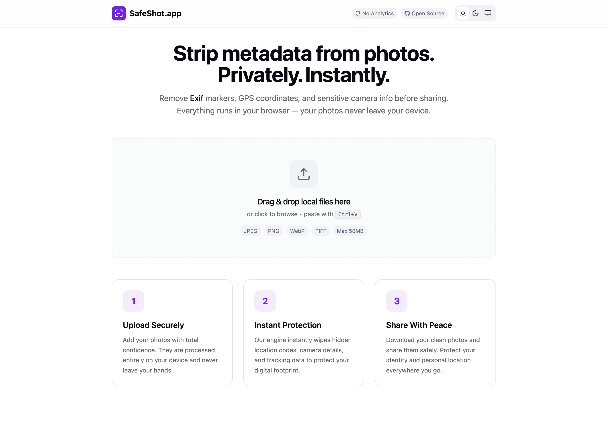

# SafeShot

> Strip photo metadata. Privately. Instantly.

[](LICENSE)


**[SafeShot.app](https://safeshot.app)** removes sensitive EXIF data (GPS, camera model, timestamp) from your photos before you share them. 

Everything runs **locally in your browser** via WebAssembly. Your photos never leave your device.



## ✨ Features

- 🔒 **100% Private** — No server uploads. Processing is local.
- ⚡ **Rust Engine** — High-performance metadata stripping via WASM.
- 🛡️ **Lossless** — Removes metadata without re-encoding the image (for JPEG/PNG/WebP).
- 📦 **Batch Processing** — Drag & drop multiple files.
- 📱 **PWA Ready** — Installable on mobile and desktop.
- 🌑 **Dark Mode** — Automatic system theme detection.

## 🛠️ Tech Stack

- **Core**: [Rust](https://www.rust-lang.org/) (img-parts, image-rs)
- **WASM**: [wasm-bindgen](https://github.com/rustwasm/wasm-bindgen)
- **Frontend**: React + TypeScript + Vite
- **Styling**: Tailwind CSS
- **Deployment**: Vercel

## 🚀 Development Setup

### Prerequisites
- [Bun](https://bun.sh/) (or Node.js 18+)
- [Rust](https://rustup.rs/)
- [wasm-pack](https://rustwasm.github.io/wasm-pack/)

### Quick Start

1. **Clone the repo**
   ```bash
   git clone https://github.com/shihweilo/safeshot.git
   cd safeshot
   ```

2. **Install dependencies**
   ```bash
   bun install
   ```

3. **Build the WASM module**
   ```bash
   bun run build:wasm
   ```

4. **Start the dev server**
   ```bash
   bun dev
   ```

## 🏗️ Building for Production

```bash
bun run build
```
This command will:
1. Compile the Rust code to WebAssembly (release mode).
2. Build the React application.
3. Output to `dist/`.

## 🤝 Contributing

We welcome contributions! Please check [CONTRIBUTING.md](CONTRIBUTING.md) for guidelines.

## 📝 License

MIT © [Chris Lo](https://github.com/shihweilo)
